# esp32-thingsboard-button-telemetry

Sprint 0 – Proyecto base ESP32 usando PlatformIO.

## GE-80 – Base PlatformIO ESP32
Este proyecto valida el entorno de desarrollo para ESP32.

### ¿Qué hace?
- Compila y flashea firmware en ESP32
- Muestra logs por monitor serial
- Verifica ejecución continua mediante uptime

### Hardware
- ESP32 DevKit (CP2102)
- Conexión USB
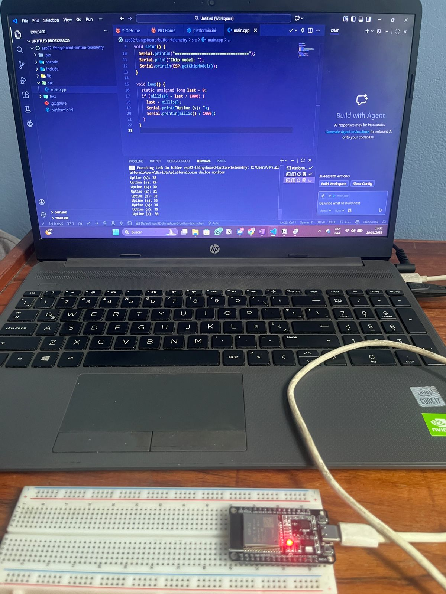

### Evidencia

### Monitor serial – ejecución del firmware

El siguiente registro demuestra que el firmware fue compilado, flasheado y ejecutado
correctamente en el ESP32, mostrando un contador de uptime continuo.

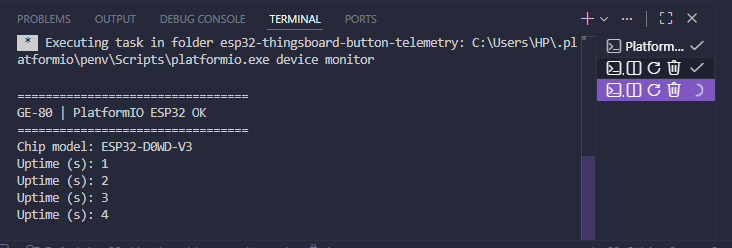

## GE-81 – Botón GPIO (evento)

Se implementó la lectura de un botón/cable en el GPIO 25 del ESP32 usando `INPUT_PULLUP`.
El firmware detecta cambios de estado (pressed/released) y los reporta por el monitor serial.

### Hardware
Estado PRESSED (GPIO en GND):  
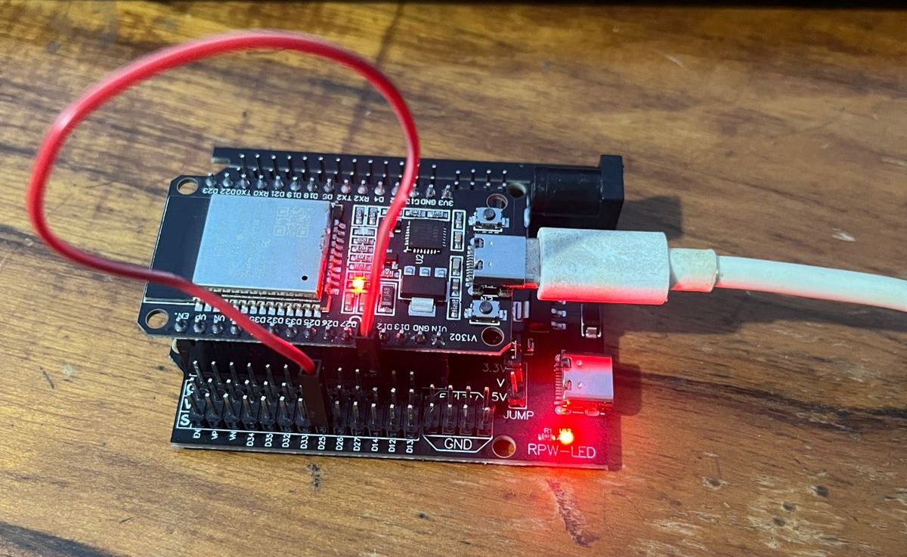

Estado RELEASED (GPIO a HIGH):
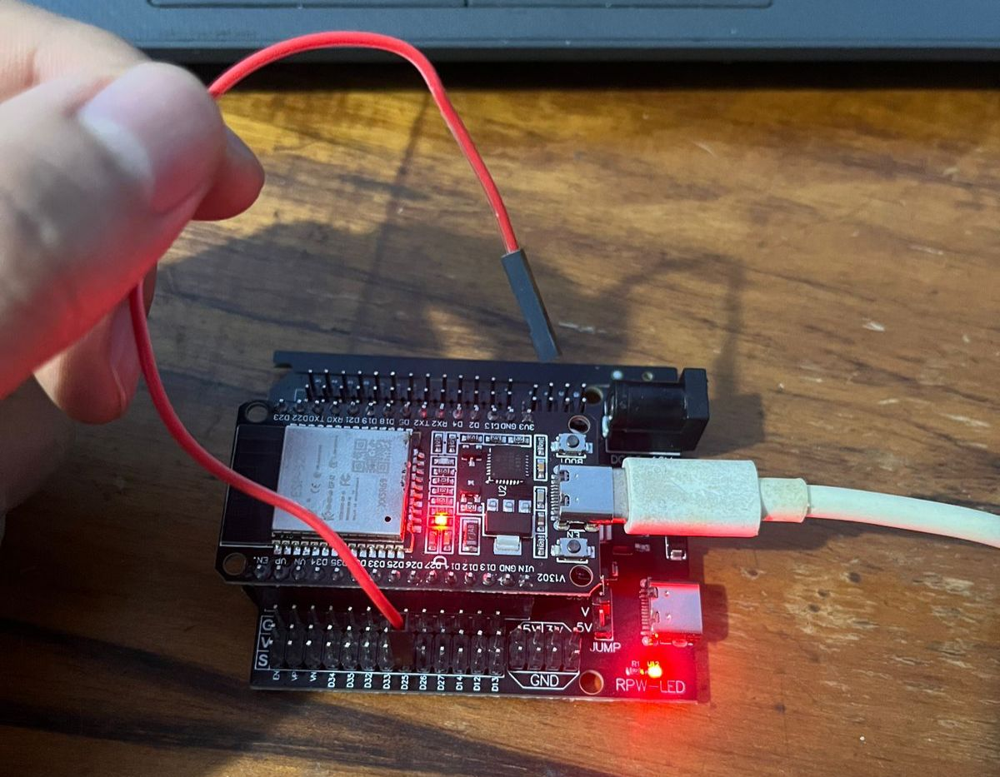 

### Evidencia – Monitor serial

#### Estado PRESSED (GPIO a GND)
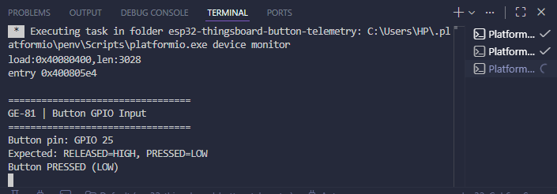

#### Estado RELEASED (GPIO en HIGH)
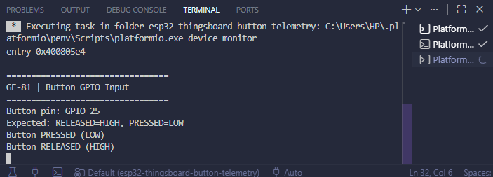

## GE-82 – Conexión WiFi (sin credenciales hardcodeadas)

### Descripción
En este ticket se implementa la conexión del ESP32 a una red WiFi utilizando el framework Arduino en PlatformIO, **evitando el hardcodeo de credenciales** dentro del código fuente.  
La solución mantiene una estructura limpia, modular y segura, permitiendo que el firmware se conecte a WiFi sin exponer información sensible en el repositorio.

Esta funcionalidad se integra sobre los tickets previos:
- **GE-80:** Base del proyecto PlatformIO para ESP32.
- **GE-81:** Lectura de botón mediante GPIO con `INPUT_PULLUP`.

---

### Implementación técnica

- La lógica de conexión WiFi se encapsula en un **módulo independiente** (`wifi_manager`), ubicado en `src/wifi/`.
- Las credenciales WiFi se definen en un archivo externo (`secrets.h`) que **no se versiona**.
- Se incluye un archivo plantilla (`secrets_template.h`) como referencia para la configuración local.
- El sistema reporta el estado de conexión, dirección IP y nivel de señal (RSSI) mediante el Monitor Serial.
- La lectura del botón GPIO continúa funcionando de manera correcta mientras el dispositivo está conectado a la red.

---

### Evidencia

La siguiente evidencia corresponde a la ejecución del firmware **GE-82**, donde se observa:

- Inicio correcto del sistema.
- Conexión exitosa del ESP32 a la red WiFi.
- Asignación de dirección IP y reporte del nivel de señal (RSSI).
- Monitoreo periódico del estado de conexión.
- Funcionamiento correcto del botón GPIO durante la conexión WiFi.

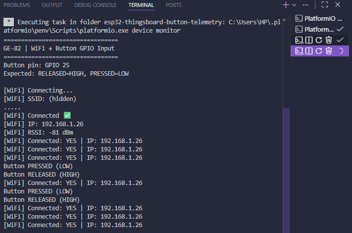

## GE-83 – Conexión MQTT a ThingsBoard (sin token hardcodeado)

### Descripción
En este ticket se implementa la conexión del ESP32 a la plataforma ThingsBoard mediante el protocolo MQTT, utilizando un **token de dispositivo almacenado de forma segura** fuera del código fuente.  
La solución evita el hardcodeo de credenciales y mantiene una estructura modular y escalable, preparada para el envío de telemetría en tickets posteriores.

Esta funcionalidad se apoya en:
- **GE-80:** Base del proyecto PlatformIO para ESP32.
- **GE-81:** Lectura de botón mediante GPIO.
- **GE-82:** Conexión WiFi sin credenciales hardcodeadas.

---

### Implementación técnica

- Cliente MQTT basado en la librería `PubSubClient`.
- Conexión al broker MQTT de ThingsBoard (`demo.thingsboard.io`).
- Autenticación mediante **token de dispositivo** (definido en `secrets.h`).
- El archivo `secrets.h` se encuentra ignorado por git.
- Se incluye `secrets_template.h` como referencia de configuración.
- El estado de la conexión se reporta mediante logs en el Monitor Serial.

---

### Evidencia

A continuación se presentan las evidencias que validan la conexión MQTT entre el ESP32 y ThingsBoard:

**1. Monitor Serial – Conexión MQTT exitosa**  
Se observa el inicio del sistema, la conexión a la red WiFi y la conexión exitosa al broker MQTT de ThingsBoard.

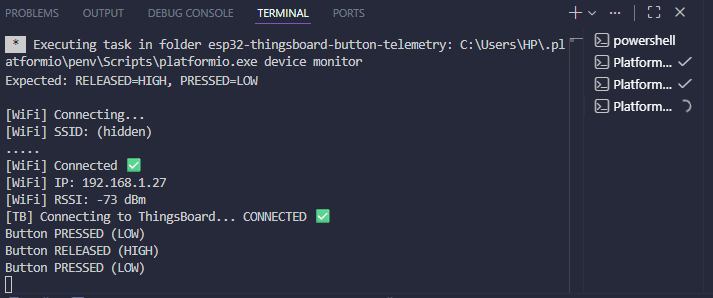

**2. ThingsBoard – Dispositivo en estado Active**  
La plataforma ThingsBoard reconoce al dispositivo como *Active*, confirmando que la autenticación mediante token y la sesión MQTT se establecieron correctamente.

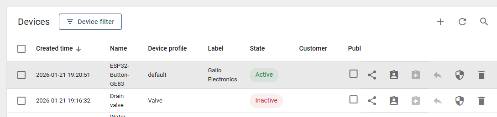

## GE-84 – Telemetría del botón a ThingsBoard (pressed/released)

### Descripción
En este ticket se implementa el envío de telemetría del estado del botón hacia ThingsBoard mediante MQTT.  
La telemetría se envía **únicamente cuando el botón cambia de estado** (PRESSED/RELEASED), evitando publicar mensajes continuamente dentro del loop.

---

### Implementación técnica
- Publicación MQTT al topic estándar de ThingsBoard: `v1/devices/me/telemetry`.
- Payload JSON enviado en cada cambio de estado:
  - `button`: `1` (PRESSED) / `0` (RELEASED)
  - `button_str`: `"PRESSED"` / `"RELEASED"`
- Envío condicionado a conexión MQTT activa (`tb_mqtt::isConnected()`).
- Logs por Monitor Serial para evidenciar publicación exitosa (sin exponer secretos).

---

### Evidencia

**1. Monitor Serial – Telemetría enviada**
Se observa la conexión WiFi/MQTT y el envío de telemetría al presionar/soltar el botón.

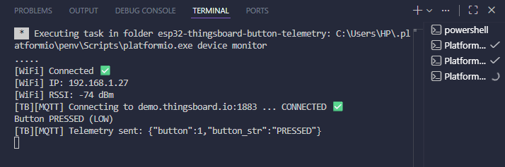

**2. ThingsBoard – Latest telemetry**
Se visualiza la última telemetría recibida por ThingsBoard (`button` y `button_str`) con timestamps recientes.

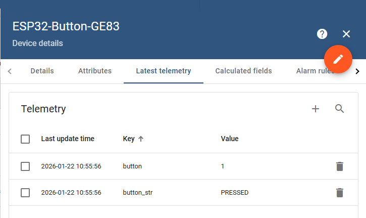

## GE-85 – Reconexión básica WiFi/MQTT

### Descripción
En este ticket se implementa un manejo básico de reconexión para mantener el ESP32 operativo ante caídas de red.  
El firmware detecta desconexiones de WiFi y MQTT e intenta recuperar la conectividad automáticamente, evitando bloqueos en bucles infinitos y manteniendo la ejecución del programa.

---

### Implementación técnica
- **WiFi reconnection (no bloqueante):**
  - Se implementa `wifi::loop()` para reintentar conexión cada cierto intervalo (`RECONNECT_INTERVAL_MS`).
  - Se detectan cambios de estado (`wl_status_t`) para registrar eventos de caída/recuperación sin saturar el log.
- **MQTT reconnection (no bloqueante):**
  - `tb_mqtt::loop()` intenta reconectar al broker de ThingsBoard cada cierto intervalo (`MQTT_RECONNECT_INTERVAL_MS`) únicamente si hay WiFi.
  - Se registran fallos de conexión (por ejemplo, DNS temporal) y recuperación exitosa.
- **Robustez:**
  - La telemetría del botón se envía solo si MQTT está conectado.
  - No se exponen credenciales ni tokens en el repositorio.

---

### Evidencia

**1. Monitor Serial – Caída y recuperación WiFi/MQTT**  
Se observa desconexión, reintentos y recuperación de WiFi, seguido de reconexión MQTT exitosa a ThingsBoard.

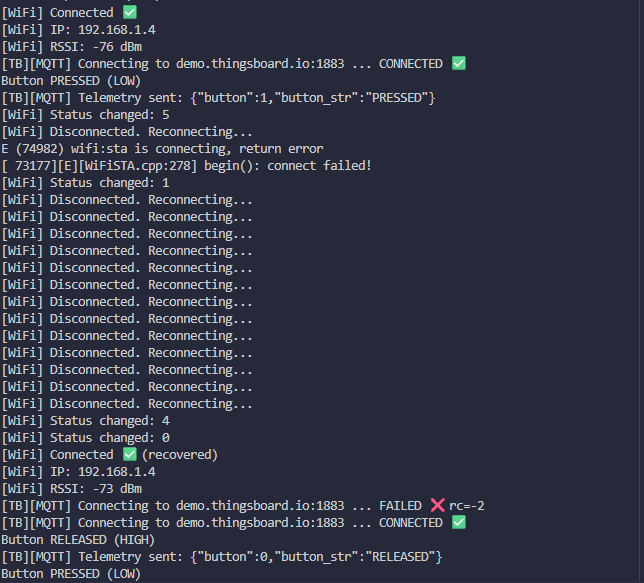

**2. ThingsBoard – Telemetría posterior a reconexión**  
Se valida que el dispositivo continúa enviando telemetría correctamente luego de recuperar la conectividad.

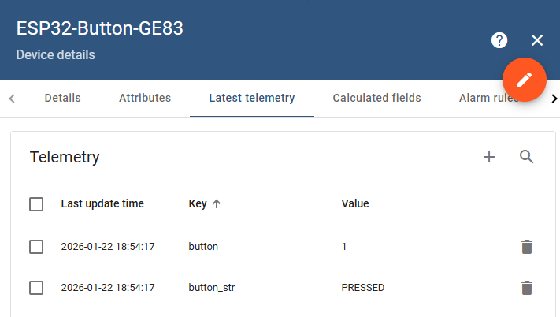

## GE-86 – Configuración local de secretos

Este repositorio NO incluye credenciales reales.

1. Copia el archivo de plantilla:
   - Copia `include/secrets.example.h`
   - Renómbralo como `include/secrets.h` (archivo local)

2. Edita `include/secrets.h` y reemplaza los valores de ejemplo
   por tus credenciales reales.

> Nota: `include/secrets.h` es un archivo local, está ignorado por Git
> y no debe subirse al repositorio.

### Evidencia

- `.gitignore` configurado para ignorar `include/secrets.h`.
- Archivo `include/secrets.example.h` versionado como plantilla sin credenciales.
- Archivo `include/secrets.h` utilizado solo en entorno local (no versionado).

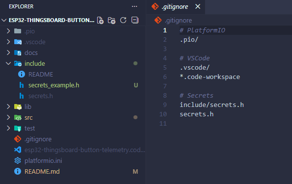

